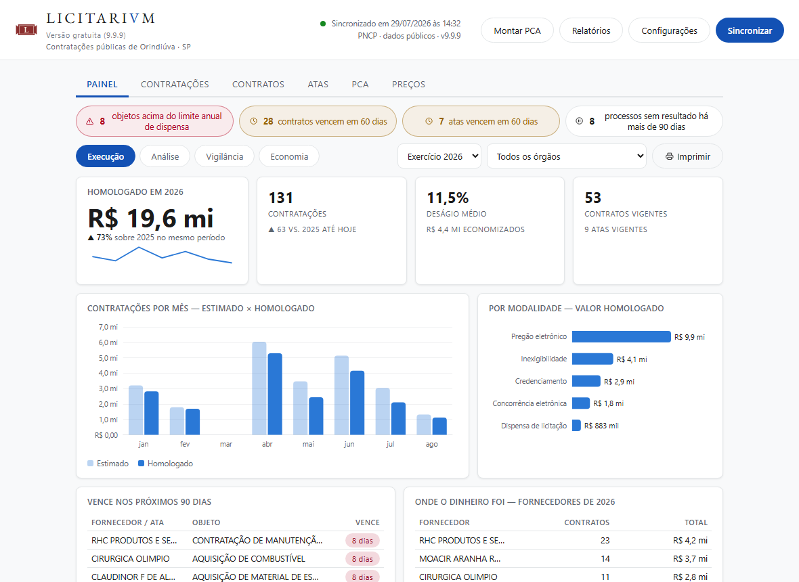
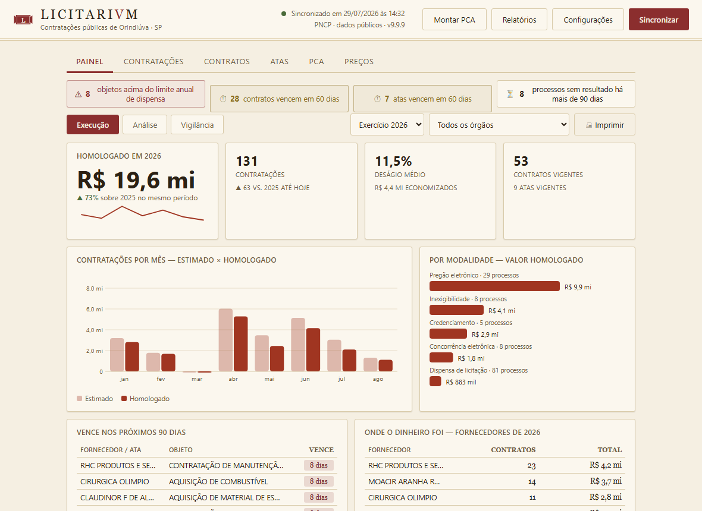
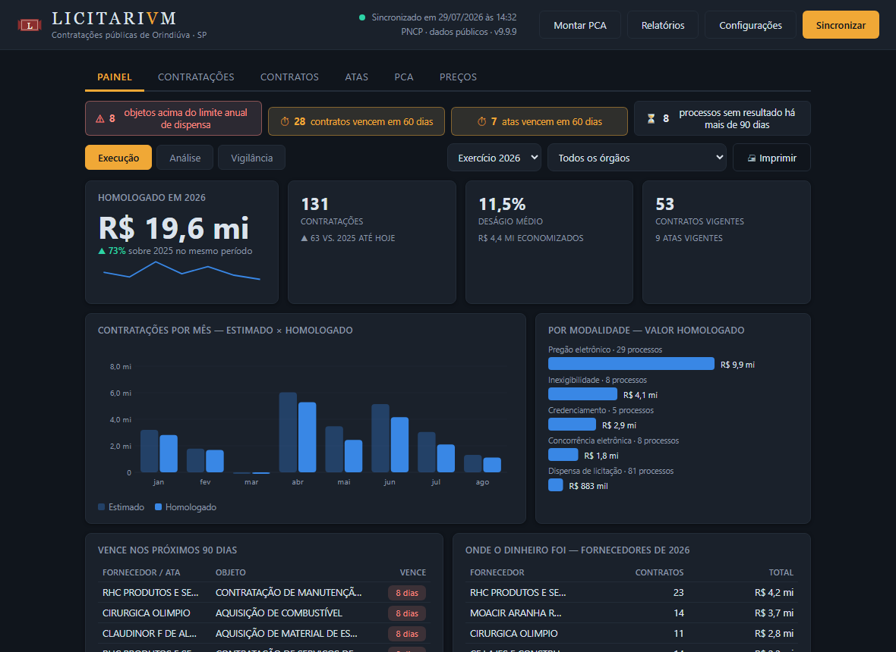

<p align="center"></p>

# Licitarium — Repositório Municipal de Contratações Públicas

       [](https://doi.org/10.5281/zenodo.21682535) [](https://github.com/devtulio/licitarium/actions/workflows/ci.yml)

## Descrição

O **Licitarium** espelha, no computador do órgão, tudo o que o município publica
no [PNCP — Portal Nacional de Contratações Públicas](https://pncp.gov.br):
contratações (editais e avisos), contratos, atas de registro de preços, o Plano
de Contratações Anual (PCA) e os **itens de cada compra, com o preço unitário
pago e o fornecedor vencedor**. O acervo fica pesquisável, offline e permanente.

O problema que ele resolve: consultar o próprio histórico de compras no portal
exige navegar processo a processo, e não há como cruzar preços entre exercícios.
O Licitarium baixa esse histórico uma vez, mantém atualizado sozinho e responde
em milissegundos — inclusive quando o portal está fora do ar.

É um **programa de computador**, não um site: instalação por executável único,
sem servidor, sem porta de rede, sem banco a configurar. Serve a qualquer
prefeitura brasileira — nada é fixo no código quanto ao município. O piloto
roda em Orindiúva-SP.

*Licitarium* — do latim *licitatio* (lance, leilão) + *-arium* (lugar que
guarda): o lugar que guarda as licitações. **SVB · HASTA · PVBLICA.**



<p align="center">
  
  
</p>

## O que ele faz

### Acervo

Cinco abas, todas com busca, filtros (ano, modalidade, situação, órgão),
ordenação por clique, colunas ajustáveis com o mouse e exportação CSV:

| Aba | Conteúdo |
|---|---|
| **Contratações** | Editais e avisos: pregões, dispensas, inexigibilidades e demais modalidades da Lei 14.133 |
| **Contratos** | Contratos firmados, com fornecedor, valor global e vigência, com selo de situação (vigente / vence em 60 dias / encerrado) |
| **Atas** | Atas de registro de preços, com objeto e vigência, com o mesmo selo de situação |
| **PCA** | Itens do Plano de Contratações Anual de cada órgão |
| **Preços** | Banco de preços: cada item contratado, com unidade, quantidade, valor unitário homologado e fornecedor vencedor |

Clicar em qualquer linha abre o detalhe completo, incluindo o **registro
integral em JSON** exatamente como consta no PNCP, e um link direto para a
página oficial do processo no portal.

Na tela inicial, três indicadores clicáveis (total de contratações, valor
homologado no ano, contratos vigentes) e alertas de **vencimento em 60 dias** e
de **propostas em aberto**.

### Banco de preços

Busca por palavras soltas: `papel a4` encontra `PAPEL SULFITE A4 BRANCO` na
ordem que você digitar, ignorando acentos (`oleo` acha `ÓLEO`) e aceitando
palavra pela metade (`sulfit` acha `SULFITE`). Índice FTS5 interno — resposta
instantânea mesmo com o acervo inteiro.

Para cada termo: **menor preço, mediana, média, maior preço**, quantos itens e
quantos fornecedores — subsídio direto à pesquisa de preços do **art. 23 da Lei
14.133/2021**, com a origem de cada valor rastreável até o processo no PNCP.

### Montar PCA

Usa o histórico de itens já contratados para sugerir o **Plano de Contratações
Anual** do exercício seguinte:

- agrupa itens semelhantes por radical da descrição, descartando prefixo
  burocrático ("AQUISIÇÃO DE", "CONTRATAÇÃO DE EMPRESA PARA");
- projeta o quantitativo (média dos anos disponíveis, último, maior ou soma);
- estima o preço (mediana, média, mais recente ou menor);
- aplica margem de segurança — padrão de 10%, editável por item;
- classifica em **curva ABC** e agrupa por **família** (PNEU, FILTRO, FRALDA…);
- sinaliza unidade divergente, ocorrência única e preço disperso;
- permite **mesclar e dividir** grupos, com preço ponderado pelo volume.

A lista é editável e os ajustes manuais sobrevivem a uma nova geração. A
entrega é uma **minuta para revisão**, não um arquivo de importação: os itens
do PNCP não trazem código de catálogo, então a conferência humana é necessária.

### Relatórios

Sete relatórios em HTML timbrado (prontos para imprimir em PDF) e, quando faz
sentido, também em CSV:

| Relatório | Uso |
|---|---|
| Relação de Contratações | Listagem para o Tribunal de Contas, com amparo legal e deságio |
| Relação de Contratos | Contratos do período, por órgão |
| Relação de Atas | Atas de registro de preços e vigências |
| Resumo Executivo Anual | Visão consolidada do exercício |
| Alerta de Fracionamento | Autocontrole: acompanha os limites do art. 75 por unidade |
| Pesquisa de Preços | Levantamento do art. 23, do menor ao maior unitário |
| Minuta do PCA | Plano sugerido, para revisão |

Os relatórios seguem o tema escolhido na tela, mas a **impressão sai sempre
clara**, para não gastar tinta nem prejudicar a leitura em papel.

## Como funciona

- Na primeira execução você escolhe o município (tabela IBGE embutida, 5.571
  municípios) e o Licitarium baixa todo o histórico publicado desde 2021.
- A cada abertura, sincroniza só o que mudou; dá para sincronizar à mão quando
  quiser. A interface fica utilizável durante a sincronização.
- Os órgãos do município (prefeitura, câmara, fundos…) são **descobertos
  sozinhos** a partir das contratações; você pode acrescentar outros por CNPJ.
- Tudo num banco SQLite local, em `%LOCALAPPDATA%\Licitarium`. O banco é cache
  reconstruível: se corromper, uma nova carga resolve.
- Sem internet, o programa abre normalmente com os dados locais e avisa que não
  conseguiu atualizar.

**Desempenho da sincronização** (acervo real de Orindiúva-SP, atualização
depois de uma semana sem abrir): **33 segundos**, 69 consultas ao portal. As
três fases baixam em paralelo e, dentro de cada contratação, só os itens que
mudaram são reconsultados.

### Privacidade

O Licitarium **apenas lê** dados públicos do PNCP. Nada do seu computador é
enviado a lugar nenhum, não há telemetria, não há conta de usuário e o programa
não abre porta de rede. As únicas conexões de saída são para `pncp.gov.br` e,
para checar se saiu versão nova, para a API pública do GitHub.

## Instalação

**Executável (recomendado):** baixe o `Licitarium.vX.Y.Z.exe` da página de
[releases](../../releases) e execute. Não precisa instalar nada, nem ter Python,
nem direitos de administrador.

> **Aviso do SmartScreen:** por ser um executável novo e não assinado, o Windows
> pode exibir "aplicativo não reconhecido". Clique em **Mais informações →
> Executar assim mesmo**. O código é aberto — você pode auditar e compilar você
> mesmo.
>
> **Windows 11 com Smart App Control:** essa proteção bloqueia binários sem
> assinatura digital. Com ela ativa, a atualização automática fica desligada
> (o aviso de versão nova leva ao download manual) e o próprio primeiro
> download pode ser barrado. Alternativas: rodar a partir do código-fonte,
> desligar o Smart App Control, ou aguardar uma versão assinada.

**A partir do código:**

```bash
pip install -r requirements.txt
python licitarium.py
```

Requisitos: Windows 10/11 com WebView2 (já incluído no Windows 11; no Windows 10,
[instale o runtime](https://developer.microsoft.com/microsoft-edge/webview2/)).
A única dependência externa é o `pywebview` — todo o resto é biblioteca padrão
do Python.

Manual completo do usuário: [MANUAL.html](MANUAL.html) (abra no navegador; o
botão 🖨 gera o PDF).

## Arquitetura

Um processo só: janela [pywebview](https://pywebview.flowrl.com/) (WebView2)
conversando com o Python por uma ponte `js_api` — sem servidor HTTP, sem porta,
sem firewall. Os dados vêm da API de consulta pública do PNCP; o JSON bruto de
cada registro é guardado como **fonte da verdade**, e as colunas do banco são
projeção dele (campo novo na interface não exige baixar tudo de novo).

```
licitarium.py        entry: janela + classe Api (ponte com o JS)
pncp.py              cliente da API do PNCP + motor de sincronização
pca_builder.py       motor da minuta do PCA (agrupamento, ABC, projeções)
relatorios.py        geração dos relatórios em HTML/CSV
ui/index.html        marcação
ui/estilo.css        três temas por data-theme
ui/app.js            lógica da interface
tests/               pytest — motor de sync com HTTP mockado
tests-e2e/           Playwright — interface com a ponte mockada
```

Decisões de projeto e os fatos da API que as motivaram: [DESIGN.md](DESIGN.md).
Identidade visual e as notas históricas por trás dela (epigrafia romana, tabula
ansata, a divisa *sub hasta publica*): [design/IDENTIDADE.md](design/IDENTIDADE.md).

## Desenvolvimento

```bash
pip install -r requirements.txt pytest
python -m pytest tests/              # motor de sync, API e relatórios
npm install && npx playwright test   # interface (Chromium)
pyinstaller --clean Licitarium.spec  # gera dist/"Licitarium vX.Y.Z.exe"
```

A cada push, o CI roda os testes de Python e de interface no Windows; ao marcar
uma tag `v*`, compila o executável e o anexa à release.

## Sistemas irmãos

Cinco sistemas livres para a administração pública municipal. Os quatro
primeiros compartilham a mesma arquitetura (servidor Python + SQLite +
frontend single-file, multiusuário em rede local); o Licitarium é um
programa de desktop e apenas lê dados públicos.

| Sistema | Cuida de | |
|---|---|---|
| **SGCD** — Contratação Direta | dispensas de licitação, do pedido ao contrato | [repositório](https://github.com/devtulio/sgcd) |
| **SGCA** — Contratos e Atas | contratos administrativos e atas de registro de preços | [repositório](https://github.com/devtulio/sgca) |
| **SGDP** — Documentos da Procuradoria | leis, decretos, portarias, pareceres e ofícios | [repositório](https://github.com/devtulio/sgdp) |
| **SGEA** — Estoque do Almoxarifado | entradas, saídas, lote e validade com FEFO | [repositório](https://github.com/devtulio/sgea) |
| **Licitarium** — Repositório do PNCP | espelho local das contratações do município | **(este)** |

---

## Como citar

Cada versão recebe um DOI no Zenodo. O DOI acima resolve sempre para a versão
mais recente; a página do Zenodo lista o DOI específico de cada uma.

> SILVA, T. R. M. **Licitarium: repositório municipal de contratações públicas
> do PNCP**. Zenodo. https://doi.org/10.5281/zenodo.21682535

## Licença

[MIT](LICENSE) — © 2026 Túlio Ribeiro de Moura e Silva.

Os dados exibidos são públicos, originários do Portal Nacional de Contratações
Públicas (PNCP), nos termos da Lei 14.133/2021 e da Lei de Acesso à Informação.
O Licitarium não é um produto oficial do PNCP nem do Governo Federal.
